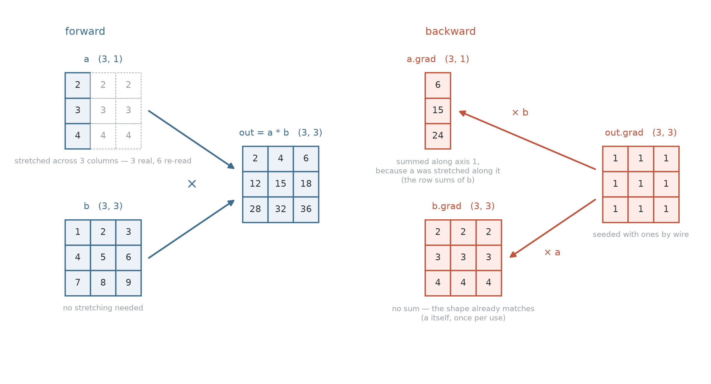

# 02 — Shapes

> 🔬 Runnable companion: [`notebooks/02_shapes.ipynb`](../notebooks/02_shapes.ipynb)

## Why?

Everything in [01](01-leaf.md) worked, but every example used a single number.
Neural-network layers, by contrast, hold matrices of weights, and a bias vector
is added to every row in a batch. `Leaf.data` has been a `np.ndarray` from the
start — now we begin to use its shape.

The moment shapes stop matching, one question decides everything:

> If a value gets **copied** on the way up, what happens to its gradient on the
> way down?

## Invariant

Every node obeys one rule, from `__init__` onwards:

```python
leaf.grad.shape == leaf.data.shape  # always
```

This is not merely a convention; it is what a gradient *is*. `data` holds one
number per knob, and `grad` holds `∂L/∂knob` — one answer per knob.

## Broadcasting

Consider this example:

```python
m + v  # m is (4, 3), v is (3,)
```

The shapes differ, but the intent does not. Written out by hand this is either a
loop over the 4 rows, or a `(4, 3)` matrix built from 4 copies of `v`. Broadcasting
is the second one.

### How

Align the shapes **from the right**, padding the shorter one with `1`s on the
left. Any axis of length `1` can then **stretch** to match the other:

$$
m : (4, 3)
\qquad
v : (3,)
\xrightarrow{\text{pad on the left}}
(1, 3)
\xrightarrow{\text{stretch the } 1}
(4, 3)
$$

`m` already has the output shape. The padded `1` in `v` stretches to `4`, so both
values can be used together at shape `(4, 3)`.

Two axes are compatible when they are **equal**, or when **one of them
is `1`**. Nothing else broadcasts:

```
(2, 3) + (2,)   →  ValueError: operands could not be broadcast
                   together with shapes (2,3) (2,)
```

Here `(2,)` aligns under the `3`, so lengths 2 and 3 are incompatible. Nothing
in its shape says that the `2` was meant to count rows. Written as `(2, 1)`, the
`1` sits under the `3` and stretches across it.

More examples:

| shapes               | result      | what stretches                                |
|----------------------|-------------|-----------------------------------------------|
| `(4, 3)` + `(3,)`    | `(4, 3)`    | the vector, padded to `(1, 3)`, down 4 rows   |
| `(4, 3)` * `(4, 1)`  | `(4, 3)`    | one number per row, across 3 columns          |
| `(3, 1)` * `(1, 4)`  | `(3, 4)`    | **both**: the column across 4, the row down 3 |
| `(4, 3)` * `()`      | `(4, 3)`    | the scalar, into all 12 entries               |
| `(8, 4, 3)` + `(3,)` | `(8, 4, 3)` | the vector, padded twice, to `(1, 1, 3)`      |

### Stretching

`strides` records how many bytes to step to advance one index along each axis.
Stretching an axis sets its stride to **zero**, so every index along it reads the
same memory:

```python
a = np.array([[1.0], [2.0], [3.0]])  # shape (3, 1), strides (8, 8)
v = np.broadcast_to(a, (3, 4))  # shape (3, 4), strides (8, 0)

v.base is a  # True — one buffer, no copy
a.nbytes, v.nbytes  # (24, 96) — only 24 bytes exist
```

Stepping along `v`'s second axis moves 0 bytes, so its four columns are the same
three numbers. No copy exists in memory. Mathematically one does: `a[i, 0]` is
**used** four times.

### Copy up, sum down

[01](01-leaf.md) established the rule: every use of a node is a path, and a node's
gradient is the sum over its paths. That is what `+=` is for.

Broadcasting produces those paths without producing nodes. If `a[i, 0]` is used in
four entries of `out`, four paths lead from it to the output, and its gradient is
the sum of four terms.



On the way up, `a` stretches across 3 columns — three real numbers, each
re-read twice — while `b` is left alone. On the way down, multiplication's cross-wire
sends each stem the incoming gradient scaled by the **other** stem; only then do
we restore the original shapes. The two stems need different fixes:

- `a.grad` is `b · out.grad` **summed along axis 1**, collapsing `(3, 3)` back to
  `(3, 1)`.
- `b.grad` is `a · out.grad` with **no sum at all**: it is already `(3, 3)`.

```
forward:   stretch an axis   (one value → many)
backward:  sum along it      (many terms → one)
```

So the backward of a broadcast sums the incoming gradient over exactly the axes
that were stretched. Forward copies, backward sums.

### Example

`out = a + b`, with `a` of shape `(3, 1)` and `b` of shape `(1, 4)`. Both stems
stretch:

$$
\begin{bmatrix}
1 \\
2 \\
3
\end{bmatrix} +
\begin{bmatrix}
10 & 20 & 30 & 40
\end{bmatrix} =
\begin{bmatrix}
11 & 21 & 31 & 41 \\
12 & 22 & 32 & 42 \\
13 & 23 & 33 & 43
\end{bmatrix}
$$

```
a.grad = [[4], [4], [4]]        shape (3, 1) ✓
b.grad = [[3, 3, 3, 3]]         shape (1, 4) ✓
```

Neither stem was padded — both stretched a length-`1` axis they already had — so
both gradients keep that axis at length `1`.

## `_unbroadcast`

```python
@staticmethod
def _unbroadcast(grad: np.ndarray, shape: Tuple[int, ...]) -> np.ndarray:
    if grad.shape == shape:
        return grad
    grad = grad.sum(axis=tuple(range(grad.ndim - len(shape))))  # axes NumPy prepended
    stretched = tuple(i for i, n in enumerate(shape) if n == 1)  # axes stretched from 1
    return grad.sum(axis=stretched, keepdims=True) if stretched else grad
```

To route a gradient back to its source, it must match the stem's original shape
exactly. During the forward pass, NumPy broadcasting changes shapes in only two
ways: it adds axes on the left and stretches existing size-1 axes.

This function reverses those two moves. Let us walk through the three common
cases it handles.

### 1. Perfect Match

**Forward pass:** `(2, 3) + (2, 3) → (2, 3)`
**Backward pass:** `grad.shape` is `(2, 3)`, stem `shape` is `(2, 3)`

When the shapes already match, no broadcasting took place.

* **In code:** `if grad.shape == shape: return grad` catches this case.

### 2. Dropping Padded Axes (Left-Side Padding)

**Forward pass:** `(2, 3) + (3,) → (2, 3)`
**Backward pass:** `grad.shape` is `(2, 3)`, stem `shape` is `(3,)`

In the forward pass, NumPy implicitly padded the `(3,)` array on the left
to make it `(1, 3)` before stretching it.

To undo this, we must sum out those newly added leading axes entirely.

* **In code:** `grad = grad.sum(axis=tuple(range(grad.ndim - len(shape))))`
* **Step by step:**

1. `grad.ndim` is 2. `len(shape)` is 1. The difference is 1.
2. The code generates `range(1)`, so it sums over `axis=(0,)`.
3. Summing a `(2, 3)` array over axis 0 *without* `keepdims` removes that
   axis entirely, leaving us with exactly `(3,)`.

### 3. Collapsing Stretched Axes (Internal Size-1 Dimensions)

**Forward pass:** `(2, 3) + (2, 1) → (2, 3)`
**Backward pass:** `grad.shape` is `(2, 3)`, stem `shape` is `(2, 1)`

Here, the number of dimensions is the same (both are 2D), so the padding step
does nothing. However, the stem's second axis was stretched from `1` to `3`.
To gather the gradient, we must sum along that stretched axis, but we **must
keep the dimension** so the final shape remains 2D.

* **In code:** `stretched = tuple(i for i, n in enumerate(shape) if n == 1)`
* **Step by step:**

1. The code looks at the stem `shape`: `(2, 1)`.
2. It finds a `1` at index 1, so `stretched = (1,)`.
3. It returns `grad.sum(axis=(1,), keepdims=True)`.
4. Summing a `(2, 3)` array over axis 1 *with* `keepdims` collapses it back to
   exactly `(2, 1)`.

## Using it

Every operation that can broadcast routes each stem's gradient through
`_unbroadcast`. For addition:

```python
self.grad += self._unbroadcast(out.grad, self.data.shape)
other.grad += self._unbroadcast(out.grad, other.data.shape)
```

For multiplication, the local derivative `other.data` is itself part of the
broadcast product, so the fitting happens *after* the multiplication:

```python
self.grad += self._unbroadcast(other.data * out.grad, self.data.shape)
other.grad += self._unbroadcast(self.data * out.grad, other.data.shape)
```
