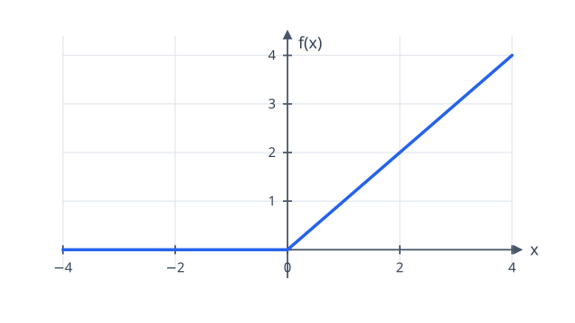
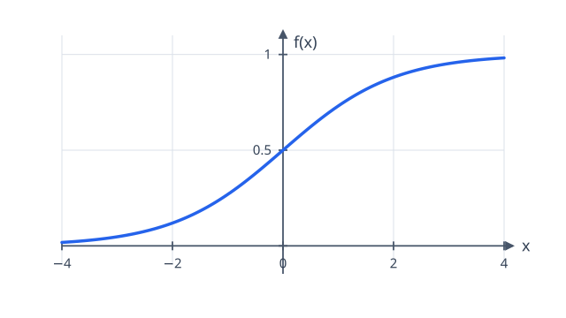
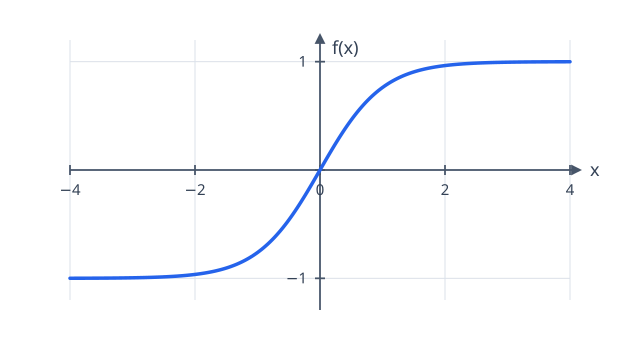

# 07 — Activation Functions

Linear gives a network trainable affine transforms:

$$
z = xW + b.
$$

That is useful, but linear layers alone cannot make a deep network more
expressive. Two affine transforms in sequence are still one affine transform:

$$
(xW_1 + b_1)W_2 + b_2 = x(W_1W_2) + (b_1W_2 + b_2).
$$

An **activation function** applies a nonlinear function to each entry between
layers. With $a = f(z)$, a two-layer network becomes

$$
x \longrightarrow xW_1 + b_1 \longrightarrow f(xW_1 + b_1)
\longrightarrow aW_2 + b_2.
$$

The function in the middle prevents the two linear layers from collapsing into
one. This lesson adds three elementwise activations: ReLU, sigmoid, and tanh.

## Same shape

For an elementwise function, every output $a_i = f(x_i)$ depends only on the
matching input $x_i$. If $G_i = \partial L / \partial a_i$ is the gradient that
arrives from later in the graph, the chain rule is

$$
\frac{\partial L}{\partial x_i}
= \frac{\partial L}{\partial a_i}
  \frac{\partial a_i}{\partial x_i}
= G_i f'(x_i).
$$

There is no axis reduction or unbroadcasting here: input, output, and incoming
gradient all have the same shape.

## ReLU

**ReLU** is the rectified linear unit:

$$
\operatorname{ReLU}(x) = \max(0, x)
= \begin{cases}
0 & x \leq 0, \\
x & x > 0.
\end{cases}
$$

Its slope is zero on the negative side and one on the positive side:

$$
\frac{d}{dx}\operatorname{ReLU}(x)
= \begin{cases}
0 & x \leq 0, \\
1 & x > 0.
\end{cases}
$$

ReLU keeps gradients unchanged for positive inputs, which is one reason it made
deep networks much easier to train than saturating activations.

Its trade-off is that a unit receiving only negative values has zero output and
zero gradient: it is a *dead ReLU* until its inputs change through another path.

## Sigmoid

The **sigmoid** squashes every real number into the open interval $(0, 1)$:

$$
\sigma(x) = \frac{1}{1 + e^{-x}}.
$$

Let $y = \sigma(x)$. Differentiating the definition gives

$$
\begin{aligned}
\frac{dy}{dx}
&= \frac{e^{-x}}{(1 + e^{-x})^2} \\
&= \frac{1}{1 + e^{-x}}
   \left(1 - \frac{1}{1 + e^{-x}}\right) \\
&= y(1-y).
\end{aligned}
$$

The last line is especially useful: the derivative needs only the forward
output, not another exponential calculation.

A direct implementation,

$$
\sigma(x) = \frac{1}{1 + e^{-x}},
$$

is unsafe for a large negative input. For example, with $x = -1000$ it
requires $e^{-(-1000)} = e^{1000}$, which is too large for a floating-point
number.

Instead, first compute

$$
m = e^{-\lvert x \rvert}.
$$

This is always safe because $-\lvert x \rvert \leq 0$, so $0 \leq m \leq 1$.
Then choose the equivalent formula for each side of zero:

$$
\sigma(x) =
\begin{cases}
\frac{1}{1 + m}, & x \geq 0, \\
\frac{m}{1 + m}, & x < 0.
\end{cases}
$$

For $x \geq 0$, $m = e^{-x}$, which is the usual sigmoid formula. For
$x < 0$, $m = e^x$, and

$$
\frac{e^x}{1 + e^x}
=
\frac{1}{1 + e^{-x}},
$$

so it produces the same result without ever computing a huge exponential.

>At large positive or negative inputs, sigmoid becomes nearly flat: its output
>is close to $1$ or $0$. Its derivative, $y(1-y)$, is then close to zero, so
>very little gradient flows backward. This is called *saturation*.

## Tanh

The hyperbolic tangent has a similar S-shape, but its output is centred around
zero and lies in $(-1, 1)$:

$$
\tanh(x) = \frac{e^x - e^{-x}}{e^x + e^{-x}}.
$$

Again call the output $y = \tanh(x)$. The derivative can be written in terms of
that output:

$$
\frac{dy}{dx} = 1 - \tanh^2(x) = 1 - y^2.
$$

>Tanh has its largest slope, one, at zero. Like sigmoid, it saturates at large
>magnitudes, where the slope approaches zero.
